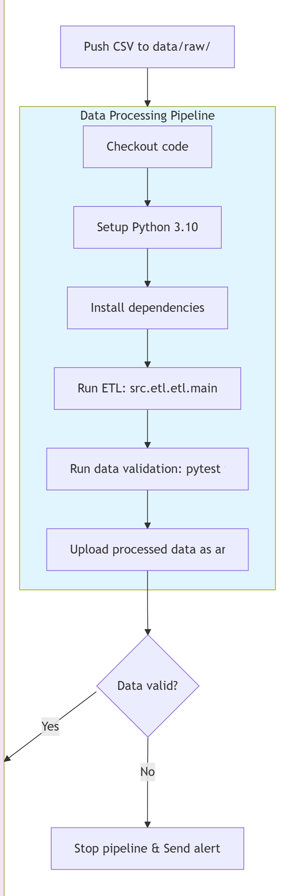
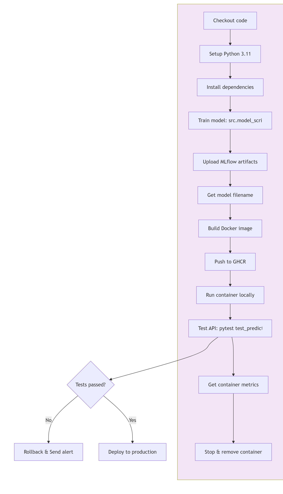

# Скоринговая система для выявления мошеннических операций в цифровом банкинге
## Описание бизнес-задачи

#### Контекст и текущее состояние
 
Система принимает решения на основе предопределённых бизнес-правил и пороговых значений.

**Проблемы текущей системы**:

|Проблемы|Последствия|
|---------|-------|
|Высокий уровень ложных срабатываний (False Positive)|Легитимные транзакции блокируются → недовольство клиентов, рост нагрузки на службу поддержки|
|Низкая адаптивность к новым схемам мошенничества|Мошенники быстро обходят статические правила → финансовые потери|
|Невозможность учёта сложных нелинейных зависимостей|Правила не могут одновременно анализировать ~20 признаков → пропуск сложных атак|
|Ручная настройка и поддержка правил|Затраты времени аналитиков, задержки во внедрении улучшений|
|Отсутствие вероятностной оценки риска|Бинарное решение «блок/разрешить» не позволяет гибко ранжировать транзакции для приоритизации проверки|

## Цель проекта

Разработать и внедрить кастомную машинную модель классификации для дополнения существующей системы, которая:

- Повысит точность обнаружения мошенничества за счёт выявления сложных паттернов в данных
- Снизит долю ложных срабатываний за счёт вероятностной оценки риска вместо бинарных правил
- Обеспечит адаптивность к изменяющимся тактикам мошенников через регулярное переобучение модели

## Формулировка задачи машинного обучения

**Тип задачи**: Бинарная классификация с дисбалансом классов

**Целевая переменная**: fraud_flag (TRUE — мошенническая транзакция, FALSE — легитимная)

**Объект прогнозирования**: Отдельная банковская транзакция

**Входные признаки (18 фичей)**:

Количественные:
- transaction_amount — сумма финансовой операции в валюте счёта.
- anomaly_score — оценка аномальности транзакции от правило-ориентированной антифрод-системы (без ML).
- account_age_days — возраст аккаунта в днях с момента регистрации.
- login_attempts — количество попыток авторизации перед успешным входом.
- transfer_frequency — частота исходящих переводов за фиксированный период.
- failed_transactions_last_30d — число отклонённых транзакций за последние 30 дней.
- avg_monthly_balance — усреднённый месячный остаток на счёте.
- daily_transaction_count — среднее количество операций в сутки.
- geo_distance_km — расстояние между геолокациями текущей и предыдущей транзакций.
- session_duration_minutes — продолжительность пользовательской сессии в минутах.
- transaction_velocity_score — метрика интенсивности проведения транзакций за короткий промежуток времени.
- device_risk_score — оценка риска устройства на основе истории его использования.
- transaction_time_hour — час суток, в который была совершена операция.

Категориальные:
- payment_channel — канал проведения платежа: POS-терминал, веб-банк, мобильное приложение или банкомат.
- authentication_type — способ подтверждения личности: OTP, биометрия, двухфакторная аутентификация или пароль.

Бинарные флаги:
- card_present_flag — индикатор использования физической карты при транзакции.
- international_transaction_flag — индикатор трансграничного характера операции.
- suspicious_ip_flag — индикатор входа с подозрительного или анонимного IP-адреса.

## Ограничения и требования

**Технические**:

**Интерпретируемость**: Возможность объяснить прогноз модели (SHAP/LIME) для аудита и регуляторных требований

**Масштабируемость**: Обработка до 10 000 транзакций в минуту

**Мониторинг**: Отслеживание дрейфа данных (data drift) и деградации качества модели через MLflow

**Изоляция**: Контейнеризация пайплайна через Docker для воспроизводимости и безопасности

**Бизнес-ограничения**:

**Консервативный запуск**: Первые 2 недели — режим «shadow mode» (прогнозы логируются, но не влияют на решения)

**Регуляторное соответствие**: Все изменения должны документироваться и проходить внутренний аудит

**Ожидаемые бизнес-результаты**:

✅ Снижение финансовых потерь от мошенничества на 15-25% за счёт более точного обнаружения

✅ Улучшение клиентского опыта: на 30% меньше ложных блокировок легитимных операций

✅ Оптимизация операционных затрат: сокращение времени аналитиков на ручную проверку

✅ Повышение гибкости: возможность быстро адаптировать систему под новые угрозы через переобучение модели

**Критерии успеха (бизнес-метрики)**
|Метрика|Значение|
|---------|-------|
|Recall|Минимизация пропущенных мошеннических транзакций — приоритет безопасности|
|Precision|Снижение ложных блокировок легитимных клиентов|
|F1-score|Баланс между recall и precision|
|AUC-ROC|Качество ранжирования транзакций по уровню риска|
|Время инференса|Соответствие требованиям real-time обработки|

## Схема пайплайна

Подробное описание пайплайна автоматизации в файле /docs/info

**Data Processing Pipeline**:

**Deploy Model Pipeline**

